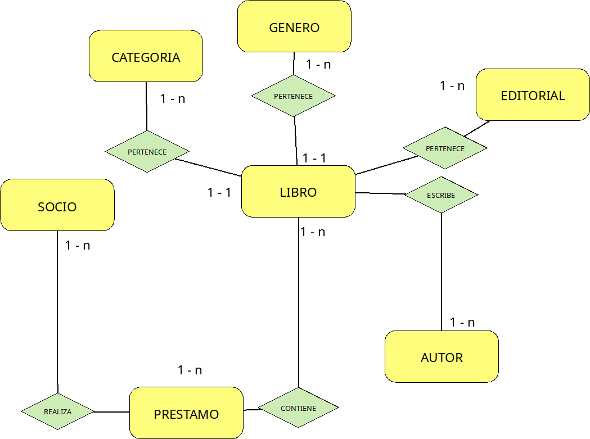

### Programación Web Dinámica **2023**
## Trabajo Practico N° 4 - MVC
# MODELOS
En este trabajo práctico empezaremos a crear nuestras clases que serán los modelos para trabajar en nuestra aplicación.

---
Modelar las siguientes clases:
- Socio
- Editorial
- Autor
- Libro
- Categoria (ejemplo: cuentos, fábulas, novelas, etc)
- Genero (ejemplo: terror, ciencia ficcion, policiales, etc)
- Prestamo

1 - Todas las clases deben extender de la clase **ModelBase** que implementa **Serializar**.

2 - Todas las clases tiene que tener los métodos get y set para los atributos a excepcion 

3 - El atributo **id** comun para todas las clases se encuentra en la clase padre ModelBase

3 - Todos los atributos tienen que ser **private**

Atributos de la clase **Socio**:
* nombre_apellido (string)
* fecha_alta (date)
* activo (int) valor 0 o 1
* telefono (int)
* direccion (string)

Atributos de la clase **Autor**:
* nombre_Apellido (string)
* activo (int) valor 0 o 1

Atributos de la clase **Categoria**:
* descripcion (string)
* activo (int) valor 0 o 1
* 
Atributos de la clase **Genero**:
* descripcion (string)
* activo (int) valor 0 o 1

Atributos de la clase **Editorial**:
* Nombre (string)
* activo (int) valor 0 o 1

Atributos de la clase **Libro**:
* titulo (string)
* editorial (Editorial)
* autor (Autor[])
* genero (Genero)
* cant_paginas (int)
* anio_publicacion (int)
* estado(string) con tres posibles estados 

  + **Activo**
  + **Inactivo**
  + **Prestado**

siendo **Activo** el estado predeterminado.
Estos estados son seteados con constante:
ejemplo: inicializamos **estado:'$this->estado = static::ACTIVO'**
donde **static::ACTIVO** corresponte a la constante **Const ACTIVO = "activo"**

Atributos de la clase **Prestamo**:
* socio (Socio)
* libro (Libro)
* fecha_desde (date)
* fecha_hasta (date)
* fecha_dev (?date) este atributo se debe inicializar en null

### **Métodos especiales de esta Clase**
---

**diasRetraso():int**  debe devolver la cantidad de días que un libro se encuentra retrasado, si aún esta dentro del rango de días debe devolver **0**

### Diagrama Base de la Aplicación
---

